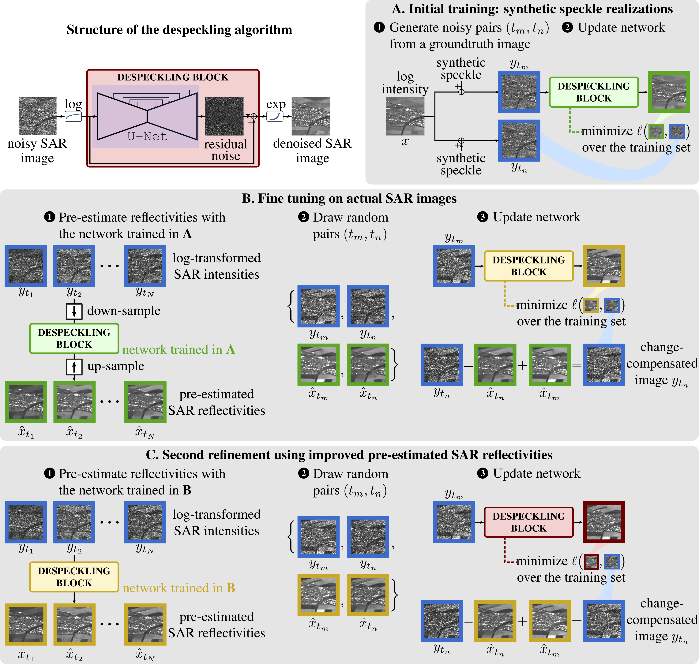

# Original code and odditional results are now on https://gitlab.telecom-paris.fr/RING/SAR2SAR

# SAR2SAR: a self-supervised despeckling algorithm for SAR images
## Emanuele Dalsasso, Loïc Denis, Florence Tupin
## Abstract
_Speckle reduction is a key step in many remote sensing applications. By strongly affecting synthetic aperture radar (SAR) images, it makes them difficult to analyse. Due to the difficulty to model the spatial correlation of speckle, a deep learning algorithm with self-supervision is proposed in this paper: SAR2SAR. Multi-temporal time series are leveraged and the neural network learns to restore SAR images by only looking at noisy acquisitions. To this purpose, the recently proposed noise2noise framework has been employed. The strategy to adapt it to SAR despeckling is presented, based on a compensation of temporal changes and a loss function adapted to the statistics of speckle.
A study with synthetic speckle noise is presented to compare the performances of the proposed method with other state-of-the-art filters. Then, results on real images are discussed, to show the potential of the proposed algorithm. The code is made available to allow testing and reproducible research in this field._

## Resources
- [Paper (ArXiv)](https://arxiv.org/abs/2006.15037)
The material is made available under the **GNU General Public License v3.0**: Copyright 2020, Emanuele Dalsasso, Loïc Denis, Florence Tupin, of LTCI research lab - Télécom ParisTech, an Institut Mines Télécom school.
All rights reserved.

To cite the article:

    @article{dalsasso2020sar2sar,
        title={{SAR2SAR}: a self-supervised despeckling algorithm for {SAR} images},
        author={Emanuele Dalsasso and Loïc Denis and Florence Tupin},
        journal={arXiv preprint arXiv:2006.15037},
        year={2020}
    }
